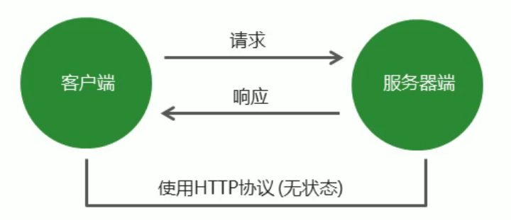
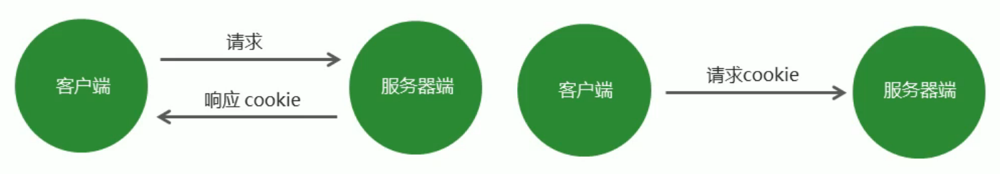

<!--
 * @Descripttion: 
 * @version: 
 * @Author: 唐帆
 * @Date: 2020-04-19 09:28:08
 * @LastEditors: 唐帆
 * @LastEditTime: 2020-04-22 13:35:48
 -->

### 1 Ajax 运行原理及实现
#### 1.1 Ajax 的实现步骤
- 1 创建 Ajax 对象
```
const xhr = new XMLHttpRequest();
```
- 2 告诉 Ajax 请求地址以及请求方式
```
xhr.open('get', url);
```
- 3 发送请求
```
xhr.send();
```
- 4 获取服务器端给客户端的响应数据
```
xhr.onload = function() {
    console.log(xhr.responseText);
}
```

#### 1.2 服务器响应的数据格式
实际中多使用 JSON 数据；


#### 1.3 请求参数传递
传统网站表单提交
```
<form action="http://www.example.com" method="GET">
    <input type="text" name="username">
    <input type="password" name="password">
</form>
```
>
ajax中：
- GET 请求方式
    ```
    xhr.open('GET', 'http://www.example.com?xxx=xxx&xxx=xxx');
    ```
- POST 请求方式
    ```
    xhr.setRequestHeader('Content-Type', 'application/x-www-form-urlencoded');
    xhr.send('name=zhangsan&age=20');
    ```
    - Content-Type 是报文属性名称；
    - application/x-www-form-urlencoded 是报文属性对应的值；
    ```
    const xhr = new XMLHttpRequest();
    let url = 'http://localhost:3000/post';
    let data = `username=${username.value}&age=${age.value}`;
    xhr.open('post', url);
    
    //  设置请求参数格式的类型（ POST 请求必须设置）
    xhr.setRequestHeader('Content-Type', 'application/x-www-form-urlencoded');
    //  post请求在此设置数据
    xhr.send(data);

    xhr.onload = function () {
        console.log(xhr.responseText);
    }
    ```
- json 格式传值
    - Content-Type 的值是 application/json
    ```
    const xhr = new XMLHttpRequest();
    let url = 'http://localhost:3000/json';
    let data = `username=${username.value}&age=${age.value}`;
    xhr.open('post', url);

    //  设置请求参数格式的类型（ POST 请求必须设置）
    xhr.setRequestHeader('Content-Type', 'application/json');
    //  post请求在此设置数据
    xhr.send(JSON.stringify({ name: username.value }));

    xhr.onload = function () {
        console.log(xhr.responseText);
    }
    ```
- <font>get请求不能提交 JSON，传统网站的表单提交也不支持 json 对象数据的格式；</font>

#### 1.x 请求报文
在 HTTP 请求和响应过程中传递的数据块就叫<font color=red> 报文 </font>，
包括要传送的数据和一些附加信息，这些数据和信息遵守规定好的格式。
- 报文体存储数据；

#### 1.4 获取服务器端的响应
- 1 ajax 状态码
    - 创建 ajax 对象，配置 ajax 对象，发送请求，以及接收服务器端相应数据，每个步骤都会对应一个数值，这就是 ajax 状态码；

    - 0：请求未初始化，还未调用 open()；
    - 1：请求已经建立，但还没有发送，还未调用 send()；
    - 2：请求已经发送；
    - 3：请求正在发送中，响应中已经有部分数据可用；
    - 4：响应数据接收完成；
    ```
    xhr.readyState;     // 获取 ajax 状态码
    ```

- 2 onreadystatechange 事件
    - 当 Ajax 状态码发生改变时，自动触发该事件；

- 3 方法对比
<table>
<tr><th>区别描述</th><th>onload 事件</th><th>onreadystatechange 事件</th></tr>
<tr><td>是否兼容 IE 低版本</td><td>不兼容</td><td>兼容</td></tr>
<tr><td>是否需要判断 ajax 状态码</td><td>不需要</td><td>需要</td></tr>
<tr><td>被调用次数</td><td>一次</td><td>多次</td></tr>
</table>

#### 1.5 ajax 错误处理
- 1 网络通畅，服务器端能接收到信息，服务器端返回的结果不是预期结果；
    - 使用<font color=red> xhr.status </font>获取 http 状态码，来判断返回是否正确；
- 2 网络通畅，服务器端没有接收到请求，返回 404 状态码；
    - 检查地址是否错误；
    - 使用 xhr.status 进行验证；
- 3 网络中断
    - 触发 xhr 对象下的 <font color=red> onerror 事件 </font>，在 onerror 函数中进行处理；
    ```
    xhr.onerror = function () {
        alert('网络中断')
    }
    ```

#### 1.6 低版本 IE 浏览器的缓存问题
- <font color=red> 问题： </font>在低版本的 IE 浏览器中，Ajax 请求有严重的缓存问题，即在请求地址不发生改变的情况下，只有第一次请求会真正发送到服务器端，后续的请求都会从浏览器的缓存中获取结果；
    - 即使服务器端的数据更新了，客户端依然拿到的是缓存中的旧数据；
- <font color=red> 解决方案： </font>
    - 在请求地址的后面加请求参数，保证每一次请求中的请求参数的值不同；
    ```
    xhr.open('get', 'http://www.example.com?t=' + Math.random());
    ```

#### 1.7 同步异步概述
- 异步
    - 程序不会等待异步代码执行完成之后再继续执行后续代码，而是直接执行后续代码；
    - 当后续代码执行完成后，再回头看异步代码是否返回结果，如果已有返回结果，再调用事先准备好的回调函数处理异步代码执行结果（如定时器）；

#### 1.8 Ajax 封装
- 见 01/server/public/14；

### 2 FormData

对于文件的上传，需要修改请求头，其他部分使用 json
'Content-Type': 'multipart/form-data'

#### 2.1 作用
- 1 模拟 HTML 表单；
- 2 异步上传二进制文件；

#### 2.2 FormData 对象的使用
- 1 准备 HTML 表单
    ```
    <form>
        <input type="text" name="username" id="">
        <input type="password" name="password" id="">
        <input type="button">
    </form>
    ```
    - 注意，按钮不是 submit，因为不是做传统的表单提交；
>
- 2 将 HTML 表单转化为<strong> formData 对象</strong>
    ```
    const form = document.querySelect('form');
    const formData = new FormData(form);
    ```
- 3 提交表单对象
    ```
    xhr.send(formData)
    ```

#### 2.3 FormData 对象的实例方法
- 1 获取表单对象中属性的值
    ```
    formData.get('key');
    ```
- 2 设置表单对象中属性的值
    ```
    formData.set('key', 'value');
    ```
    - 对于已存在的属性，则替换；
    - 对于不存在的属性，则创建；
- 3 删除表单对象中属性的值
    ```
    formData.delete('key');
    ```
- 4 向表单对象中追加值
    ```
    formData.append('key', 'value');
    ```
    - 对于已存在的属性，append 会保留两个值；

#### 2.4 FormData 二进制文件上传
- formData.append('attrName', this.files[0]);
- 同样可以使用 append 追加文件外的其他数据；
```
<input type="file" id="file" />

const file = document.getElementById('file');
// 当用户选择文件时触发 onchange 事件
file.onchange = function () {
    // 创建空表单对象
    const formData = new FormData();
    // 将用户选择的二进制文件追加到表单对象中
    formData.append('attrName', this.files[0]);
    // 追加文件外的其他数据
    formData.append('test', 'test');

    // 配置 ajax 对象，请求方式必须为 post
    xhr.open('post', 'www.example.com');
    xhr.send(formData);
}
```

#### 2.5 FormData 文件上传进度展示
- onprogress 是文件上传过程中持续触发的事件；
    - 事件中的两个重要属性：
        - 事件中的 loaded 属性是已上传的量；
        - 事件中的 total 属性是总的、需要上传的量；
```
// 当用户选择文件的时候
file.onchange = function () {
    // 文件上传过程中持续触发 onprogress 事件
    xhr.upload.onprogress = function (ev) {
        // 当前上传文件大小/文件总大小，再将结果转为百分比
        // 将结果赋值给进度条的宽度属性
        bar.style.width = (ev.loaded / ev.total) * 100 + '%';
    }
}
```

#### 2.6 FormData 文件上传图片即时预览
将图片上传到服务器后，服务器端再将图片地址作为响应回传到客户端，客户端从响应数据中获取图片地址，然后将图片进行显示；

### 3 同源政策
#### 3.1 ajax 请求限制
ajax 只能向自己的服务器端发送请求，如前端和后台都在同的 ip 和端口；

#### 3.2 什么是同源
如果两个页面拥有相同的<strong>协议、域名和端口</strong>，那么这两个页面就属于同源，只要有一个不相同，就是不同源；
- http://www.example.com/dir/page.html
    - 同源网页：http://www.example.com/dir/other.html
    - 不同源网页（域名不同）：http://example.com/dir/other.html
    - 不同源网页（端口不同）：http://www.example.com：81/dir/other.html
    - 不同源网页（协议不同）：https://www.example.com/dir/other.html

#### 3.3 同源政策的目的
- 同源政策是为了保证用户信息的安全，防止恶意的网站窃取数据；
- 最初的同源政策是指 A 网站在客户端设置的 Cookie，B 网站不能访问；
- 其中有一项规定就是无法向非同源地址发送 ajax 请求，如果请求，浏览器就会报错；

#### 3.4 使用 JSONP 解决同源限制问题
- jsonp 是 json with padding 的缩写，它不属于 ajax 请求，但可以模拟 ajax 请求；
- 1 将不同源的服务器端请求地址写在 script 标签的 src 属性中；
    ```
    <script src="www.example.com"></script>
    ```
    - script 的 src 不受同源的限制；

- 2 服务器端响应数据必须是一个函数的调用，真正要发送给客户端的数据需要作为函数调用的参数；
    - 由于在 script 中请求后返回的数据必须是 js 代码，所以数据传递以函数调用的形式存在；
    - 需要的参数则放在 js 中，如下为服务器端中的代码，回传字符串形式的函数调用代码；
    - 03 => s2 => app.js
    ```
    const data = 'fn({name: "张三", age: "20"})';
    res.send(data)
    ```

- 3 在客户端全局作用域下定义函数 fn；
    - 需写在 1 中 script 标签的前面；
    ```
    function fn (data) {}
    ```
- 4 在 fn 函数内部对服务器端返回的数据进行处理
    ```
    function fn (data) { console.log(data); }
    ```

#### 3.5 JSONP 代码优化
- 1 客户端需要将函数名称传递到服务器端；
    - 避免因为函数改名带来的连锁反应；
    - 服务器端回传的函数也命名为客户端传递的函数名；
- 2 将 script 请求的发送变成动态发送请求；
- 3 封装 jsonp 函数，方便请求发送；
- 03/s1/public/04 jsonp代码封装.html

#### 3.6 CORS 跨域资源共享
Cross-origin resource sharing；
允许浏览器向跨域服务器发送 ajax 请求；


```
origin: http://localhost:3000
```
- 浏览器根据服务器返回的响应头中是否包含 Access-Control-Access-Origin 来判断服务器是否允许此次请求；
```
Access-Control-Access-Origin:'http://localhost:3000'
Access-Control-Access-Origin:'*'
```
- 在服务器端设置响应头即可，客户端继续使用 ajax 请求；
- 如需验证，url：localhost:3001/cross；
- 03/s2/app.js app.use;

#### 3.7 cookie 复习


- 无状态：服务器端不关心客户端是谁，只响应请求，请求结束就断开连接；


- 服务器端发给客户端“身份证”，也就是 cookie

#### 3.8 withCredentials 属性
- 在使用 ajax 技术发送跨域请求时，默认情况下不会在请求中携带 cookie 信息；
- withCredentials：指定在涉及到跨域请求时，是否携带 cookie 信息，默认值是 false；
- Access-Control-Allow-Credentials: true 允许客户端发送请求时携带 cookie；

- 1 客户端发送请求时携带 cookie ：
    - xhr.withCredentials = true;
    ```
    loginBtn.onclick = function () {
        // 将 html 对象转为 form 表单
        const formData = new FormData(loginForm);
        const xhr = new XMLHttpRequest();
        xhr.open('post', 'http://localhost:3001/login');

        // 当发送跨域请求时，携带 cookie 信息
        xhr.withCredentials = true;

        // 发送请求
        xhr.send(formData);
        xhr.onload = function () {
            console.log(xhr.responseText);
        }
    };
    ```

- 2 服务器端获取 cookie，并设置后返回
    - 设置接收 cookie：res.header('Access-Control-Allow-Credentials', true);
    - 设置 cookie 中信息（基于 cookie 的会话技术）：req.session.isLogin = true;
    ```
    // 拦截所有请求
    app.use((req, res, next) => {
        // 1.允许哪些客户端访问我
        // * 代表允许所有的客户端访问我
        // 注意：如果跨域请求中涉及到cookie信息传递，值不可以为*号 比如是具体的域名信息
        res.header('Access-Control-Allow-Origin', 'http://localhost:3000')
        // 2.允许客户端使用哪些请求方法访问我
        res.header('Access-Control-Allow-Methods', 'get,post')
        // 允许客户端发送跨域请求时携带cookie信息
        res.header('Access-Control-Allow-Credentials', true);
        next();
    });

    app.post('/login', (req, res) => {
        // 创建表单解析对象
        var form = formidable.IncomingForm();
        // 解析表单
        form.parse(req, (err, fields, file) => {
            // 接收客户端传递过来的用户名和密码
            const { username, password } = fields;
            // 用户名密码比对
            if (username == 'itheima' && password == '123456') {
                // 设置session
                req.session.isLogin = true;
                res.send({ message: '登录成功' });
            } else {
                res.send({ message: '登录失败, 用户名或密码错误' });
            }
        })
    });
    ```

### 4 $.ajax()
#### 4.1 $.ajax() 方法概述
作用：发送 ajax 请求
```
$.ajax({
    type: 'get',
    url: 'www.example.com',
    data: { name:'张三' },
    contentType: 'application/x-www-form-urlencode',
    beforeSend: function () {
        return false;
    },
    success: function (response) {},
    error: function (xhr) {},
})

$.ajax({
    type: 'get',
    url: 'www.example.com',
    data: JSON.stringfy({ name:'张三' }),
    contentType: 'application/json',
    // 可以在请求发送前进行其他操作
    // 如加载动画，如数据验证
    beforeSend: function () {
        return false;
    },
    success: function (response) {},
    error: function (xhr) {},
})
```
- beforeSend 可以用于组织请求发送；
    ```
    beforeSend: function () {
        // 中止 ajax 请求发送
        return false;
    },
    ```

#### 4.2 $.ajax() 方法概述
作用：将表单中的数据自动拼接成字符串类型的参数；
formData 是由 h5 提供的方法，存在兼容问题；
```
const params = $('#form').serialize();
```
- return false; 能够用于终止表单提交；
```
$('#form').on('submit', function () {
    return false;
});
```
