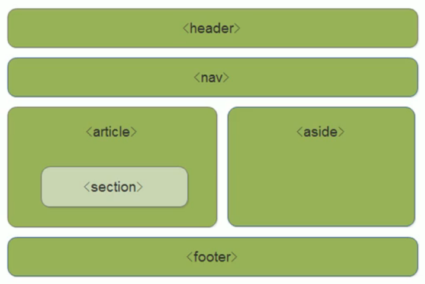

<!--
 * @Descripttion: 
 * @version: 
 * @Author: 唐帆
 * @Date: 2020-04-08 13:36:25
 * @LastEditors: 唐帆
 * @LastEditTime: 2020-04-12 23:07:24
 -->

### 1 浮动
#### 1.1 传统网页布局的三种方式
- 普通流
- 浮动
- 定位

#### 1.2 标准流（普通流/文档流）
标签按规定好的默认方式排列
- 1 块级元素独占一行，从上到下顺序排列；
- 2 行内块元素按顺序从左至右；
三种（普通流、浮动、定位）都是用来摆放盒子的；

#### 1.3 为什么需要浮动
- 1 解决div并列的需求；
- 2 盒子左右对齐的效果；
- ……
浮动最典型的应用：可以让多个块级元素一行内排列显示；
<font color=red>多个块级元素纵向排列用标准流，横向排列用浮动；</font> 

#### 1.4 什么是浮动
- float属性用于创建浮动框，将其移动到一边，直到左边缘或右边缘触及包含块或另一个浮动框的边缘；

#### <font color=red>1.5 浮动特性</font> 
- 1 浮动元素会脱离标准流；
    - 脱离标准普通流的控制，移动到指定位置；
    - 浮动的盒子不再保留原先的位置；
    - 如果下一行div没有设置浮动，会产生叠加效果；
    ```
    .box1 {
            width: 200px;
            height: 200px;
            background-color: pink;
            float: left;
    }

    .box2 {
        width: 300px;
        height: 300px;
        background-color: rgb(0, 217, 255);
    }
    ```
- 2 浮动元素会一行内显示，并且元素顶部对齐；
    - <font color=blue>父元素装不下所有的浮动的元素，会自动换行；</font> 
- 3 浮动元素会具有行内块的特性；
    - 无论原来是行内元素还是块级元素；
    - 块级元素如果没有设置宽度，默认宽度和父元素一致，但添加浮动后，它的大小根据内容来决定；
    - 浮动的盒子之间是没有空隙的；
    - 行内元素同理；

#### 1.6 浮动元素经常和标准流父级搭配使用
<font color=blue>先用标准流的父元素排列上下位置，之后内部子元素采取浮动排列左右位置，符合网页布局第一准则；</font> 


### 2 常见网页布局
#### 2.1 常见网页布局
- 从上至下用div布置标准流：

- 划分更细的：


#### 2.2 浮动布局注意点
##### 1 浮动和标准流的父盒子搭配
##### 2 如果其中一个子盒子浮动了，那其它所有盒子都要浮动


### 3 清除浮动
#### 3.1 为什么要清除浮动
- 很多情况下不适合给定高度，需要由子盒子撑开
- 但是由于浮动元素不占位置，此时父元素的高度就变成零；
- 从而导致下方的标准流占据父元素本应在的位置，造成浮动元素和下方标准流的重叠；


#### 3.2 清除浮动的本质
- 清除浮动的本质是清除浮动带来的影响；
- 如果父盒子本身带有高度，则不需要清除浮动；
- <font color=blue>清除浮动后，父级就会根据浮动的子盒子自动检测高度，父级有了高度，就不会影响下面的标准流了；</font> 


#### 3.3 清除浮动
- 1 语法：
    ```
        选择器 { clear: 属性值; }
    ```
    - 属性值
        - left 清除左浮动影响；
        - right 清除右浮动影响；
        - both 同时清除左、右浮动影响；
    - 实际开发中只用 both；
    - <strong>清除浮动的策略：闭合浮动；</strong> 
    - <strong>清除浮动方法</strong>
- 2 清除浮动方法
    - 1 额外标签法也称为隔墙法，是W3C推荐的做法
        - 在最后一个浮动标签的后面再添加一个div，设置其 clear 属性；
        - 缺点：添加了许多无意义的标签，结构化较差；
        ```
            .clear {
                clear: both;
            }

            <div class="box">
                <div class="demo"></div>
                <div class="demo"></div>
                <div class="demo"></div>
                <div class="clear"></div>
            </div>
            <div class="footer"></div>
        ```
    - <strong>2 父级添加 overflow 属性</strong>
        - 将overflow的属性设为hidden、auto或scroll；
        - 设置为 hidden 时还能避免边框合并；
        - 缺点：无法显示子元素的溢出部分；
        ```
            .box {
                overflow: hidden;
                width: 700px;
                margin: 0 auto;
                background-color: darkgrey;
            }
        ```
    - <strong>3 父级添加 after 伪元素</strong>
        - 额外标签法的升级版
        - 通过css的伪元素，在父元素中添加一个位于末尾的子元素，撑开父元素；
        - 百度、淘宝等使用；
        - 缺点：需要照顾低版本浏览器；
        - visibility 会继续占据空间，而display不会；
        ```
            .clearfix:after {
                content: "";
                display: block;
                height: 0;
                clear: both;
                visibility: hidden;
            }

            .clearfix {
                /* IE6、7专有 */
                *zoom: 1;
            }

            <div class="box clearfix">
                <div class="demo"></div>
                <div class="demo"></div>
                <div class="demo"></div>
            </div>
            <div class="footer"></div>
        ```
    - <strong>4 父级添加双伪元素</strong>
        - 也是给父元素添加；
        - 通过css的伪元素，在父元素中添加一个位于末尾和一个位于开头的两个子元素；
        - 小米、腾讯等使用；
        - 缺点：需要照顾低版本浏览器；
        ```
            .clearfix:before,
            .clearfix:after {
                content: "";
                display: table;
            }

            .clearfix:after {
                clear: both;
            }

            .clearfix {
                /* IE6、7专有 */
                *zoom: 1;
            }

            <div class="box clearfix">
                <div class="demo"></div>
                <div class="demo"></div>
                <div class="demo"></div>
            </div>
            <div class="footer"></div>
        ```

### 4 PS切图
#### 4.2 图层切图
- 最简单的切图方式：右击图层 → 快速到处为PNG；
    - 在右侧图层列表；
    - 右击列表中还有合并图层，从而将不同图层能够合并为一个图层后导出；

#### 4.3 切片切图
- 1 利用切片选中图片
    - 利用切片工具手动划出
- 2 导出选中的图片
    - 文件 → 导出 → 存储为web格式
        - PNG-24 能够用于存储无背景透明图；
    - 对于无背景图，需要先隐藏背景图
