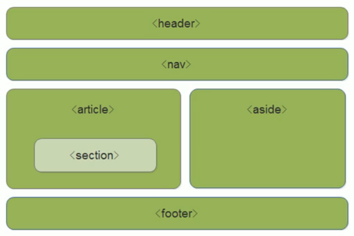

<!--
 * @Descripttion: 
 * @version: 
 * @Author: 唐帆
 * @Date: 2020-04-16 14:15:57
 * @LastEditors: 唐帆
 * @LastEditTime: 2020-04-19 14:56:41
 -->

### 1 HTML5 的新特性
增加了新标签、新表单和新特性；
IE9以上才兼容，如不考虑兼容问题，则可以大量使用（如移动端）；
- 1 重点是常用新特性；

#### 1.1 HTML5 新增的语义化标签
div 对于搜索引擎来说是没有语义的；
- header：头部标签
- nav：导航标签
- article：内容标签
- section：定义文档某个区域
- aside：侧边栏标签
- footer：尾部标签
- 主要是针对搜索引擎的
- 可以多次使用
- 在IE9中需要转为块级元素才能使用
>


#### 1.2 HTML5 新增的多媒体标签
- <strong>1 音频：audio；</strong>
    - 有 MP3 Wav Ogg 三种格式；
    - 语法
    ```
    <audio src="文件地址" controls="controls"></audio>
    ```
    - 属性
        - autoplay autoplay 视频就绪自动播放（谷歌浏览器需要添加muted来解决自动播放问题）；
        - controls controls 向用户显示播放器控件；
        - loop loop 播放完是否继续循环播放
        - src url
    - Chrome 把音频和视频自动播放禁止了；
- <strong>2 视频：video；</strong>
    - 尽量使用 MP4；
    - 另外还有 Ogg 格式；
    - 语法：
    ```
    <video src="文件地址" controls="controls"></video>
    ```
    - 属性
        - autoplay autoplay 视频就绪自动播放（谷歌浏览器需要添加muted来解决自动播放问题）；
        - controls controls 向用户显示播放器控件；
        - width px
        - height px
        - loop loop 播放完是否继续循环播放
        - preload auto（预先加载视频）| none（不应加载视频）
        - src url
        - poster Imgurl 加载等待的画面图片
        - muted muted 静音播放
    - 视频静音后可以自动播放；
- 从而不再使用flash等插件


#### 1.3 HTML5 新增的 input 类型
- 验证的时候必须添加 form 表单域；
- 使用 submit 进行提交；
<table>
    <tr><td>type="email"</td><td>限制用户输入必须为 Email 类型</td></tr>
    <tr><td>type="url"</td><td>限制用户输入必须为 URL 类型</td></tr>
    <tr><td>type="date"</td><td>限制用户输入必须为 date 类型</td></tr>
    <tr><td>type="time"</td><td>限制用户输入必须为 time 类型</td></tr>
    <tr><td>type="month"</td><td>限制用户输入必须为 month 类型</td></tr>
    <tr><td>type="week"</td><td>限制用户输入必须为 week 类型</td></tr>
    <tr><td>type="number"</td><td>限制用户输入必须为 number 类型</td></tr>
    <tr><td>type="tel"</td><td>限制用户输入必须为 tel 类型</td></tr>
    <tr><td>type="search"</td><td>限制用户输入必须为 search 类型</td></tr>
    <tr><td>type="color"</td><td>限制用户输入必须为 color 类型</td></tr>
    <tr><td>type="submit"</td><td>提交按钮</td></tr>
</table>


#### 1.4 HTML5 新增的表单属性
<table>
    <tr><th>属性</th><th>值</th><th>说明</th></tr>
    <tr><td>required</td><td>required</td><td>表单拥有该属性表示其内容不能为空，必填</td></tr>
    <tr><td>placeholder</td><td>提示文本</td><td>表单的提示信息，存在默认值将不显示</td></tr>
    <tr><td>autofocus</td><td>autofocus</td><td>自动聚焦属性，页面加载完成后聚焦到指定表单</td></tr>
    <tr><td>autocomplete</td><td>off/on</td><td>浏览器基于之前输入的值，显示出可能的选项，<br>默认已经打开，关闭autocomplete="off"<br>需要放在表单内，加上name属性，同时提交成功</td></tr>
    <tr><td>multiple</td><td>multiple</td><td>可以多选文件提交</td></tr>
</table>
```
/* 设置占位符颜色 */
input::placeholder {
    color: springgreen;
}

<input 
    type="search" name="search" 
    id="" required="required"        
    placeholder="填入" autofocus="autofocus"
    autocomplete="off"
>
```

### 2 CSS3
存在兼容性问题

#### 2.1 属性选择器 
- 属性选择器可以根据元素特定属性来选择元素，这样就可以不用借助于类或者 id 选择器；
- 权重为 0, 0, 1, 0；
- 类选择器、属性选择器、伪类选择器权重相同；

```
input[name="username"] {
    outline: none;
    border: 3px solid skyblue;
}
```
<table>
    <tr><th>选择符</th><th>简介</th></tr>
    <tr><td>E[att]</td><td>匹配有 att 属性的 E 元素</td></tr>
    <tr><td><strong>E[att="val"]</strong></td><td>匹配有 att 属性且属性等于 val 的 E 元素</td></tr>
    <tr><td>E[att^="val"]</td><td>匹配有 att 属性且值以 val 开头的 E 元素</td></tr>
    <tr><td>E[att$="val"]</td><td>匹配有 att 属性且值以 val 结尾的 E 元素</td></tr>
    <tr><td>E[att*="val"]</td><td>匹配有 att 属性且值中含有 val 的 E 元素</td></tr>
</table>


#### <font color=red>2.2 结构伪类选择器</font>
- 根据文档结构来选择元素，常用于根据父级选择器里面的子元素；
```
/* 选择第一个孩子，且必须是 li */
ul li:first-child {
    color: red;
}

ul li:nth-child(2) {
    color: red;
}

// 使用 even 选出奇数行
ul li:nth-child(even) {
    background-color: red;
    color: white;
}
```
- ul li:nth-child(even) // 使用 even 选出奇数行
- ul li:nth-child(odd) // 使用 odd 选出偶数行
- ul li:nth-child(n) // n 是选择所有
    - n 可以被公示替代
        - 2n 取出偶数项
        - 2n + 1 取出奇数项
        - 5n 取出 5 的倍数项
        - n + 5 从第五项开始
        - -n + 5 前五项
        - 数字可以是任何数字
- div:nth-child(n) 会包含所有标签类型，同时需要满足设置的标签类型，都满足方能选中；
- div:nth-of-type(n) 只包含指定元素，如此处为div； 
<table>
    <tr><th>选择符</th><th>简介</th></tr>
    <tr><td>E:first-child</td><td>匹配父元素中的第一个子元素 E</td></tr>
    <tr><td>E:last-child</td><td>>匹配父元素中的最后一个子元素 E</td></tr>
    <tr><td><strong>E:nth-child(n)</strong></td><td>>匹配父元素中的第 n 个子元素 E</td></tr>
    <tr><td>E:first-of-type</td><td>指定类型 E 的第一个</td></tr>
    <tr><td>E:last-of-type</td><td>指定类型 E 的最后一个</td></tr>
    <tr><td><strong>E:nth-of-type(n)</strong></td><td>指定类型 E 的第 n 个</td></tr>
</table>

#### <font color=red>2.3 伪元素选择器</font>
- 伪元素选择器可以用于利用 css 创建新标签元素，不需要 HTML 标签，从而简化 HTML 结构；
>
- after 和 before 创建的元素是行内元素；
- 新创建的元素在文档树中是找不到的；
- <strong>语法：element::before()；</strong>
- after 和 before 必须有 content 属性；
>
- <strong>伪元素选择器</strong>和<strong>标签选择器</strong>一样，权重为0, 0, 0, 1；
>
<table>
    <tr><th>选择符</th><th>简介</th></tr>
    <tr><td>::before</td><td>在元素内部的前面插入内容</td></tr>
    <tr><td>::after</td><td>在元素内部的后面插入内容</td></tr>
</table>

```
div {
    width: 200px;
    height: 200px;
    background-color: pink;
}

div::before {
    /* content是必须要写的，元素内容 */
    content: 'before 伪元素选择器';
}

div::after {
    /* content是必须要写的，元素内容 */
    content: 'after 伪元素选择器';
}
```
- <strong>content 必须填写，可以写空字符串； </strong>
>
- 在伪元素中使用 iconfont：
    ```
    @font-face {
        font-family: "iconfont";
        src: url('iconfont.eot?t=1587189598280');
        /* IE9 */
        src: url('iconfont.eot?t=1587189598280#iefix') format('embedded-opentype'),
            /* IE6-IE8 */
            url('data:application/x-font-woff2;charset=utf-8;base64,d09GMgABAAAAAAJwAAsAAAAABiAAAAIjAAEAAAAAAAAAAAAAAAAAAAAAAAAAAAAAHEIGVgCCcAooRgE2AiQDCAsGAAQgBYRtBzIbbgXILrBt2JMiJESQDXTjExAAiOD5/b7Nue9+1bRqcaNJFE0LNDyRiFs3oa1TOqFoJv/9X7p0TKPyfLfcQ01/I//fmLm0hedxGiERBoSECkU85Jegb+7hAvs8l9ObQAdyV32gXPegNQYNoF4cUKB7YBRZCWXcMHbBC3xMoG5GQ+7k7HiBqsxeFYj3b7QB1UJAllm6KpQbDmbxWUk1PaVv4FP0/finF1WSUsGuuny5smH6i5NVPE4ePQSEIAEdL6HAFpCJ28bEuYJgXEE9UbQAjlUe/DKZBHZxVItgf51d2gRTMBn84q0UIMFjUYYbkzYR5Rf7pEf216s366Re+xcwRT8rDtKBHILvT23nf7WRwc97HpmzYS5Q3cwZfL5s4EA2FLYtZU3WOJ6UD9tWV8cE9vT9TTWOrpUJVaMJrorpDIWqJTKzWyhp2EZZ1T7qNm2ONwywgsg1bPgACF2fSNp+oND1Q2b2FyVj/yjrRoG6+xhc2LASb+rHH8gQstF8R9eKI+U6pB6Xn0jfA4Pzioi/EWduGLutTjm9oYh4iS3ZQ/dEFCqOQ1yD5ygIYkw49siSliOS9Ntt1fSmlhWHUHeMEYMgNmR6h1yWWEQFk0W98vkTot0FDNzRV5e+ISzjzo66WjoDyI02GtT3KK9kHrQeIRSksFgIrcE8EgjEUNI8z0MsosWZEEv0tZ1Raqi2tb0+/LtTUGebUjg1herHN0akfQsAAAAA') format('woff2'),
            url('iconfont.woff?t=1587189598280') format('woff'),
            url('iconfont.ttf?t=1587189598280') format('truetype'),
            /* chrome, firefox, opera, Safari, Android, iOS 4.2+ */
            url('iconfont.svg?t=1587189598280#iconfont') format('svg');
        /* iOS 4.1- */
    }

    .iconfont {
        font-family: "iconfont" !important;
        font-size: 16px;
        font-style: normal;
        -webkit-font-smoothing: antialiased;
        -webkit-text-stroke-width: 0.2px;
        -moz-osx-font-smoothing: grayscale;
    }

    div::after {
        position: absolute;
        font-family: "iconfont" !important;
        font-size: 16px;
        font-style: normal;
        -webkit-font-smoothing: antialiased;
        -webkit-text-stroke-width: 0.2px;
        -moz-osx-font-smoothing: grayscale;
        /* top: ; */
        content: '\e77b';
    }
    ```

- 原本直接放在“ iconfont ”类中的样式放在对应伪类中，然后将“&#x”改为“\”即可（如 \&#xe77b; ，在content中变为 \e77b）；

#### 2.4 CSS3 盒子模型
- CSS3 中可以通过 box-sizing 来指定盒模型，分别是 content-box、border-box；
- 这样就可以该表计算盒子大小的方式；
- 可以分成两种情况：
    - 1 box-sizing: content-box 盒子大小为 width + padding + border （默认）；
    - 2 box-sizing: border-box 盒子大小为 width；
    ```
    .div2 {
        width: 200px;
        height: 200px;
        background-color: skyblue;
        border: 5px solid greenyellow;
        padding: 15px;
        box-sizing: border-box;
    }
    ```
- 使用通配符进行统一默认配置；
    ```
    * {
        margin: 0;
        padding: 0;
        box-sizing: border-box;
    }
    ```

#### 2.5 CSS3 其他特性（了解）
1 CSS3 滤镜 filter；
- 用于将模糊或颜色偏移等图形效果应用于元素；
    ```
    filter: 函数();     
    例如：filter: blur(5px); blur模糊处理 数值越大越模糊
    ```

2 CSS3 calc 函数：
- calc() 使声明css属性值时执行一些计算；
    ```
    width: calc(100% - 80px);
    ```
    - 上例中使得子元素永远比父元素窄 80px；
- 可以使用运算符

#### <font color=red>2.6 CSS3 过渡</font> 
在不使用 Flash 动画或 javascript 的情况下，配置元素样式变化过度效果；
- 主要是过渡效果；
- 与 :hover 搭配使用；
```
transition: 要过渡的属性 花费时间 运动曲线 何时开始;
```
- 要过渡的属性：如果是所有属性，可以写 all ；
- 花费时间：单位为秒，必须写单位，如 0.5s；
- 运动曲线：可以省略；
    - linear：匀速；
    - ease：缓慢减速；
    - ease-in：加速；
    - ease-out：减速；
    - ease-in-out：先加速后减速；
- 何时开始：用于延迟，可以省略；
```
div {
    width: 200px;
    height: 100px;
    background: no-repeat;
    background-image: url(../1.jpg);
    background-size: 100% 100%;
    transition: background-image 1s, width 1s;
}

div:hover {
    background-image: url(../2.jpg);
    width: 400px;
}
```
- 改变多个属性则用逗号分开，或用all；
- <font color=red>直接用 all 最常见；</font>

