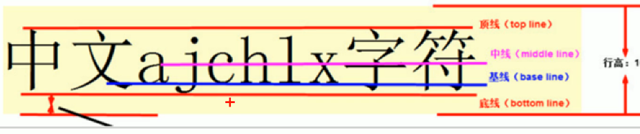

<!--
 * @Descripttion: 
 * @version: 
 * @Author: 唐帆
 * @Date: 2020-04-13 18:57:02
 * @LastEditors: 唐帆
 * @LastEditTime: 2020-04-16 14:14:23
 -->

### 1 精灵图
#### 1.1 为什么需要精灵图
- 一个网页中往往会应用很多小的背景图像作为修饰，当网页中的图像过多时，服务器就会频繁地接收和发送请求图片，造成服务器请求压力过大，这将大大降低页面的加载速度；
- 因此，为了有效地减少服务器接收和发送请求的次数，提高页面的加载速度，出现了CSS精灵技术；
- 核心原理：将网页中的一些小背景图整合到一张大图中，这样服务器只需要请求一次就行了；
- 产品图等不需要；

#### 1.2 精灵图的使用
- 1 精灵图主要针对背景图使用，就是把多张小背景图整合到一张图中；
- 2 这个大图片就叫精灵图 或 sprites；
- 3 移动背景图片位置，此时可以使用 <font color=red>background-position</font>；
- 4 移动距离就是这个目标图片的 x 和 y 坐标，注意网页中的坐标有所不同；
- 5 因为一般都是往上往左移动，座椅多为负值；

### 2 字体图标
- icomoon 字库 http://icomoon.io
- iconfont 阿里子库 http://www.iconfont.cn

### 3 三角制作
```
    .box2 {
        margin-top: 100px;
        width: 0;
        height: 0;
        border: 100px solid transparent;
        border-right: 100px solid red;
    }
```

### 4 CSS 用户界面样式
- 更改鼠标样式
- 表单轮廓
- 防止表单域拖拽

#### 4.1 鼠标样式 cursor
```
    filter { cursor: style }
```
- pointer：手型；
- move：移动，十字箭头；
- text：文本，“I”；
- not-allowed：禁止;

#### 4.2 轮廓线 outline
- 给表单添加 outline: 0; 或者 outline: none; 后，就可以去掉默认的蓝色边框；
    ```
    input { outline: none; }
    ```

#### 4.3 防止拖拽文本域 resize
开发中，文本域右下角是不可以拖拽的；
```
text { resize: none; }
```


### 5 vertical-align 属性应用
css 的 vertical-align 属性使用场景：经常用于设置图片或表单（行内块元素）和文字之间的对齐；
- 只针对行内元素或行内块元素有效；
```
vertical-align: baseline | top | middle | bottom
```
- 元素放在父元素的基线上
    
- top：把元素的顶端与行中最高元素的顶端对齐；
- middle：把此元素放置在父元素中部；
- bottom：把元素的顶端与行中最低的元素的顶端对齐；

#### 5.1 图片、表单和文字对齐
图片、表单都属于行内块元素，默认的 vertical-align 是基线对齐；

- 上图中，vertical-align 元素的值是middle；

#### 5.2 解决图片底部空白缝隙
空白缝隙是为同一行中的文字准备的，因为系统中默认图片和文字的基线进行对齐，而不是文字的底线或者中线等；
- 1 提倡使用的方法
    - 给图片添加<font color=red> vertical-align: middle | top | bottom </font>等；
- 2 将图片转为块级元素；


### 6 溢出文本省略号显示
#### 6.1 单行文本溢出显示省略号
```
/* 1 强制一行内显示文本 */
white-space: nowrap; ( 默认 normal 自动换行 )
/* 2 超出的部分隐藏 */
overflow: hidden;
/* 3 文字用省略号替代超出的部分 */
text-overflow: ellipsis;
```
#### 6.2 多行文本溢出显示省略号
有较大的兼容性问题，适合于 webKit 浏览器或移动端（移动端大部分是 webKit 内核）；
```
text-overflow: ellipsis;
/* 弹性伸缩盒子模型显示 */
display: -webkit-box;
/* 限制在一个块级元素显示的文本的行数 */
-webkit-line-clamp: 2;
/* 设置或检索伸缩盒对象的子元素的排列方式 */
-webkit-box-orient: vertical;
```

### 7 常见布局技巧
#### 7.1 margin 负值的运用
比如在两个盒子都有 1px 宽边框的情况下，将 margin-left 设为 -1，就可以避免边框变宽的问题；
- 但是当设置了鼠标经过边框变色时，一侧边框会被压住
    - 1 将相关元素的定位改为相对定位，但是可能会影响布局；
    ```
    ul li {
        list-style: none;
        float: left;
        margin-left: -1px;
        width: 150px;
        height: 200px;
        border: 1px solid red;
    }

    ul li:hover {
        position: relative;
        border: 1px solid blue;
    }
    ```
    - 2 当其他元素也都有定位时，上面的方法就不适用了，可以通过 z-index 来实现，需要注意的是，此时需要所有元素均有浮动；
    ```
    ul li {
        position: relative;
        list-style: none;
        float: left;
        margin-left: -1px;
        width: 150px;
        height: 200px;
        border: 1px solid red;
    }

    ul li:hover {
        z-index: 1;
        border: 1px solid blue;
    }
    ```

#### 7.2 文字围绕浮动元素
- 对于浮动元素，虽然会压住块级元素，但不会压住块级元素内的文字，所以能够显示出环绕的效果；

#### 7.3 行内块的巧妙运用
- 1 只要给父盒子添加水平居中，父盒子中的所有<strong>行内块元素</strong>和<strong>行内元素</strong>就会水平居中；

#### 7.4 css 三角强化
制作直角、非等腰三角形；
- 1 上边框宽度调大；
- 2 左侧和下侧边框设为0；
- 3 右侧边框设置颜色，其余均为透明；
```
.box1 {
    width: 0;
    height: 0;
    border-color: transparent red transparent transparent;
    border-style: solid;
    border-width: 22px 8px 0 0;
}
```

### 8 css 初始化
目的是消除不同浏览器对 HTML 文本呈现差异，实现兼容；
每个网页都需要进行 css 初始化；
```
/* 所有标签内外边距清零 */
* {
    margin: 0;
    padding: 0
}

/* em 和 i 不倾斜 */
em,
i {
    font-style: normal
}

/* li 去除小圆点 */
li {
    list-style: none
}

img {
    /* border: 0 是照顾低版本浏览器 */
    border: 0;
    /* 解决底部空隙问题 */
    vertical-align: middle
}

button {
    /* 经过按钮时鼠标变手 */
    cursor: pointer
}

a {
    color: #666;
    text-decoration: none
}

a:hover {
    color: #c81623
}

button,
input {
    /* 指定字体 */
    /* "\5B8B\4F53" 是宋体，unicode编码格式 */
    font-family: Microsoft YaHei, Heiti SC, tahoma, arial, Hiragino Sans GB, "\5B8B\4F53", sans-serif
}

body {
    /* -webkit-font-smoothing css3的抗锯齿性 */
    -webkit-font-smoothing: antialiased;
    background-color: #fff;
    font: 12px/1.5 Microsoft YaHei, Heiti SC, tahoma, arial, Hiragino Sans GB, "\5B8B\4F53", sans-serif;
    color: #666
}

.hide,
.none {
    display: none
}

/* 清除浮动 */
.clearfix:after {
    visibility: hidden;
    clear: both;
    display: block;
    content: ".";
    height: 0
}

.clearfix {
    *zoom: 1
}
```
