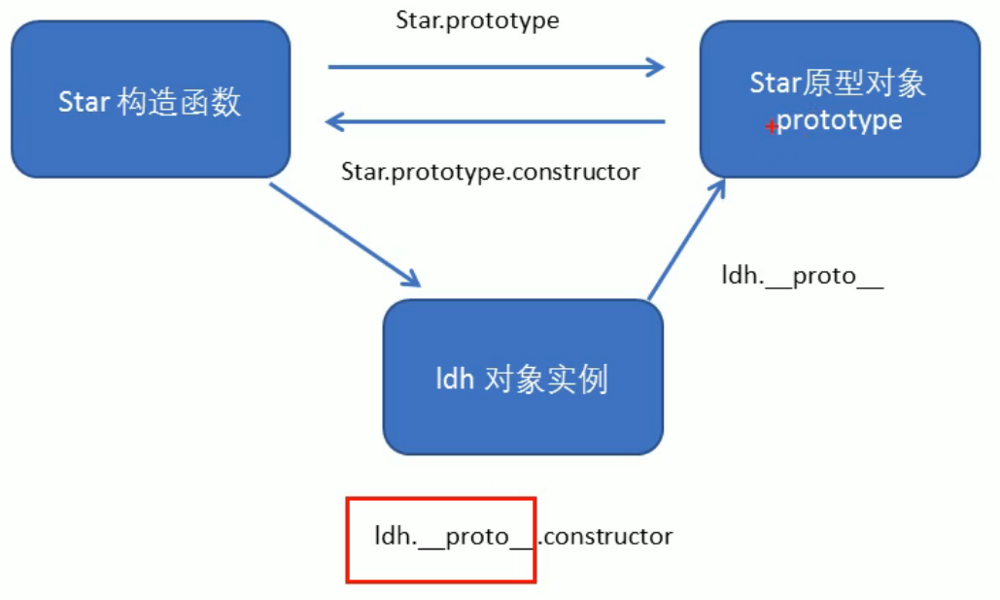
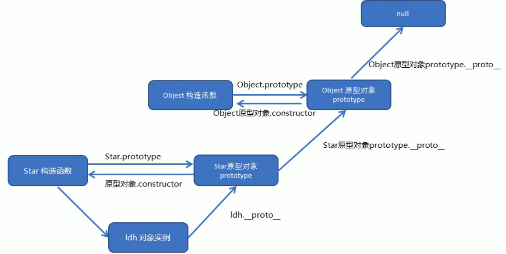
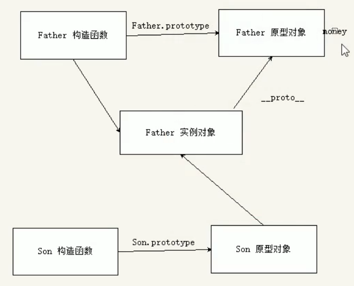

<!--
 * @Descripttion: 
 * @version: 
 * @Author: 唐帆
 * @Date: 2020-04-10 10:36:13
 * @LastEditors: 唐帆
 * @LastEditTime: 2020-04-12 09:38:16
 -->
 ### 1 构造函数和原型
 #### 1.1 概述
 在ES6之前没有类的概念，是通过构造函数来实现的；

 创建对象的三种方式：
 - 1 对象字面量；
    - const obj1 = new Object();
 - 2 new Object()；
    - const obj2 ={};
 - 3 自定义构造函数；
```
    function Star(a, b) {
        this.a = a;
        this.b = b;
        this.sing = function () {};
    }

    const test = new Star(); // 实例化
```

#### 1.2 构造函数
用于初始化对象，总和new一同使用，可以将对象中一些公共的属性和方法抽取出来，然后封装到这个函数中；
- <font color=blue>构造函数要与new一起使用才有意义</font>
- new 在执行时会做四件事
    - 1 在内存中创建一个新的空对象；
    - 2 让this指向这个新对象；
    - 3 执行构造函数里面的代码，给这个新对象添加属性和方法；
    - 4 返回这个新对象（所以构造函数中不需要return）；

##### 实例成员
- 通过this添加的成员是实例成员；
- 实例成员只能通过实例化的对象来访问，比如上例中的 ‘test’ 对象；
    - test.sing();
    - test.a;
    - Star().sing()是不可行的；

##### 静态成员
在构造函数本身上添加的成员；
```
    Star.sex = "男";
```
- sex就是静态成员；
- 静态成员只能通过构造函数来访问；
    - Star.sex;
    - text.sex则是不可行的；

#### 1.3 构造函数的问题
- 存在内存浪费的问题；
    - 简单数据类型虽然可以直接赋值，但是复杂数据类型就不可以，比如上例中的 sing 函数，对于每一个实例化对象都必须另外开辟空间来存储；

#### 1.4 构造函数原型prototype
构造函数通过原型分配的函数是<font color=red>所有对象共享的</font>，不用单独开辟空间；
- js规定。<font color=red>每个构造函数都有一个prototype属性</font>，指向另一个对象；
- 这个对象的所有属性和方法都会被构造函数所拥有；
- <font color=blue>可以把那些不变的方法直接定义在prototype对象上，这样所有对象的实例就可以共享这些方法；</font>
```
    function Star(uname, age) {
        this.uname = uname;
        this.age = age;
    }
    Star.prototype.sing = function () {
        console.log("sing");
    }

    const test1 = new Star('test1', 12);
    console.dir(Star);
    test1.sing()
```
- 将公共方法定义到原型对象身上，公共属性则放在构造函数中；

#### 1.5 对象原型 \_\_proto__
```
    test1.__proto__
```
- \_\_proto__对象原型和原型对象prototype是等价的；
```
    console.log(test1.__proto__ === Star.prototype);    // true
```
- 方法的查找规则：
    - 首先看实例对象（如上例中的test1）是否有相应方法，如果有就执行这个对象上的方法；
    - 如果没有，由于有__proto__，就可以去构造函数原型对象prototype身上去查找对应的方法；

#### 1.6 constructor 构造函数
- <font color=red>对象原型（\_\_proto__）和构造函数（prototype）原型对象</font>都有一个属性：constructor（称为构造函数），因为它指回构造函数本身；
```
    console.log(test1.__proto__.constructor);
    console.dir(Star.prototype.constructor);
```
- constructor主要用于记录该对象引用于哪个构造函数，它可以让原型对象重新指向原来的构造函数；
    - 如果修改了原来的原型对象，且给原型对象赋值的是一个对象（如下），则必须手动地利用contructor指回原来的构造函数；
```
    function Star(uname, age) {
        this.uname = uname;
        this.age = age;
    }

    Star.prototype = {
        // 通过设置constructor属性，避免因覆盖造成原有的constructor丢失
        constructor: Star,
        sing: function () {
            console.log('sing');
        },
        movie: function () {
            console.log('movie');
        },
    }
```

#### 1.7 构造函数、实例、原型对象三者之间的关系
- prototype中包含有constructor属性；
- 原型对象通过constructor指回构造函数；
- 对象实例通过__proto__.constructor指向原型对象和指向构造函数；
- 图中的ldh与上例的test1一样，都是用class类实例化后的对象；

- 函数的 prototype 指向原型对象，对象实例的__proto__指向原型对象的 prototype ，原型对象的 constructor 指回构造函数；

#### 1.8 原型链
- 1 只要是对象就有__proto__原型，指向原型对象；
>
- 2 Star原型对象里面的__proto__原型指向的是 Object.prototype；
>
- 3 Object.prototype原型对象里面的__proto__原型指向null；
>
- 4 当实例对象使用一个函数（或属性）时，会如下图进行逐层查找，如最终查找至null，则就是没有该属性或方法；
    >
    - 比如 toString() 方法只用 Object 才有，但对象实例和原型对象都能使用；


#### 1.9 Javascript的成员查找机制（规则）
- 1 当访问一个对象的属性（包括方法）时，首先查找这个对象自身有没有该属性；
>
- 2 如果没有就查找它的原型（也就是__proto__指向的prototype原型对象）；
>
- 3 如果还没有就查找原型对象的原型（Object的原型对象）；
>
- 4 依此类推一直找到Object为止（null），如1.8节中的图；
```
    Star.prototype.sex = "男";
    Object.prototype.sex = "男";

    test1.sex = "男";
```
- 5 当对象实例和构造函数拥有同样属性时，优先使用对象实例上的属性；

#### 1.10 原型对象this指向
- 1 在构造函数中，里面this指向的是对象实例，如test1；
>
- 2 原型对象函数中的 this 同样指向实例化对象，如test1；
    - 实际上还是谁调用，this 就指向谁；

#### 1.11 扩展内置对象
- 可以通过原型对象，对原来的内置对象进行扩展自定义的方法，比如数组增加自定义求偶数和的功能；
    - 实例见 11 扩展内置对象.html；
- 注意：数组和字符串内置对象不能给原型对象覆盖操作 Array.prototype = {} ，只能是 Array.prototype.xxx = function(){} 的方式；


### 2 继承
- ES6 之前通过<font color=blue>构造函数+原型对象</font>模拟实现继承，被称为组合继承；
#### 2.1 call()
- 调用这个函数，并且修改函数运行时的this指向；
```
    fun.call(thisArg, arg1, arg2, ...)
```
- thisArg：当前调用函数this的指向对象；
- arg1，arg2：传递的其它参数；
```
    // call方法

    function fn(x, y) {
        console.log('test1');
        console.log(this);
        console.log(x + y);
    }
    const o = {
        name: 'andy',
    };
    // fn();
    // 1 用 call() 调用函数
    //   this指向window
    fn.call();
    // 2 call() 可以改变函数的 this 指向
    //   此时 this 指向 o
    //   同时可以实现传值
    fn.call(o, 1, 2);
```

#### 2.2 借用构造函数继承父类型属性
```
    // 借用父构造函数继承属性
    // 1 父构造函数
    function Father(uname, age) {
        // this 指向父构造函数的对象实例
        this.uname = uname;
        this.age = age;
    }

    // 2 子构造函数
    function Son(uname, age) {
        // this 指向子构造函数的对象实例
        // 调用父构造函数，且将父构造函数中的this改为子构造函数中的this
        Father.call(this, uname, age);
    }

    const sun = new Son('test1', 12);
    console.log(sun);
```

#### 2.3 借用原型对象继承父类型方法
- 2.2 中的继承只能继承写在构造函数中的属性/方法，以原型对象设置的方法并不能继承，如下；
```
    function Father(uname, age) {
        // this 指向父构造函数的对象实例
        this.uname = uname;
        this.age = age;
    }

    Father.prototype.money = function () {
        console.log('make money');
    }
```
- 将子原型变为父原型的对象实例，再将其后遭函数重新指回，就能解决上面的问题：
```
    // 下面这样的赋值会造成修改子原型对象时，父原型对象一同修改
    // Son.prototype = Father.prototype;

    // 新建一个实例对象，此时Son的原型和Father的原型不是同一个
    // Son变成了 Father 的一个实例对象
    // Father 的实例对象指向 Father 原型对象
    Son.prototype = new Father();

    // 如果利用对象的形式修改了原型对象，别忘了利用constructor指回原来的构造函数
    Son.prototype.constructor = Son;

    Son.prototype.exam = function () {
        console.log('exam');
    }
```
- 实例见 13 借助构造函数继承父类属性.html；



### 3 ES5 新增方法
#### 3.1 数组方法
- 迭代（遍历）方法：forEach()、map()、filter()、some()、every()；
- forEach()
    ```
        array.forEach(function(currentValue, index, arr))
    ```
    - currentValue：数组当前项的值；
    - index：数组当前项的索引；
    - arr：数组对象本身；
>
- filter()
    ```
        array.filter(function(currentValue, index, arr))
    ```
    - filter()方法创建一个新的数组，新数组中的元素是通过检查指定数组中符合条件的所有元素，<font color=blue>主要用于筛选数组；
    - 注意它直接返回一个新数组；</font>
- some()
    ```
        array.some(function(currentValue, index, arr))
    ```
    - some()方法用于检测数中是有满足元素的条件的元素；
    - <font color=blue>注意它返回值是布尔值，如果有满足条件的元素，则返回true，否则返回false；</font>
    - 找到第一个满足条件的元素就终止；
    - 需要手动 return true;
    ```
        data.some(function (value) {
            if (value.pname === product.value) {
                arr.push(value);
                return true;
            }
        });
    ```
- map 类似于forEach；
- every 类似于some；

#### 3.3 字符串方法
- trim() 方法用于删除字符串两端的空白字符；
```
    str.trim()
```
- trim() 方法并不影响原字符串本身，它返回的是一个新的字符串；
- 可以用于解决用户输入空格的问题；

#### 3.4 对象方法
- 1 Object.keys() 用于获取对象自身所有的属性；
    ```
        Object.keys(obj)
    ```
    - 返回一个属性名组成的数组；
>
- 2 Object.defineProperty() 定义对象中新属性或修改原有的属性；
    ```
        Object.defineProperty(obj, props, descriptor);

        Object.defineProperty(obj, 'num', {
            value: 45,
        });
    ```
    - 三个参数都是必须的；
    - obj：目标对象；
    - prop：需定义或修改的属性名字；
    - description：目标属性所拥有的特性；
        - description也是一个对象；
        - value：属性值，默认undefined；
        - enumerable：是否可以被枚举，默认false；
            - 该属性在遍历获取属性名时，无法被获取；
        - writable：是否可以重写，默认false；
        - configurable：是否可以删除，或是否可以再次修改特性，默认false；
            - 无法使用 delete obj.name 进行删除属性；
            - 不允许修改 descriptor 的三种特性；
        ```
            // 将原有属性设为不可修改状态
            Object.defineProperty(obj, 'id', {
                writable: false,
            });
        ```

### 其它
- 使用 function 来创建函数会有一个提升作用；
    - 可以在 function 定义前使用；
- 而使用 const 则不会；
    - 必须在定义后才能使用函数；